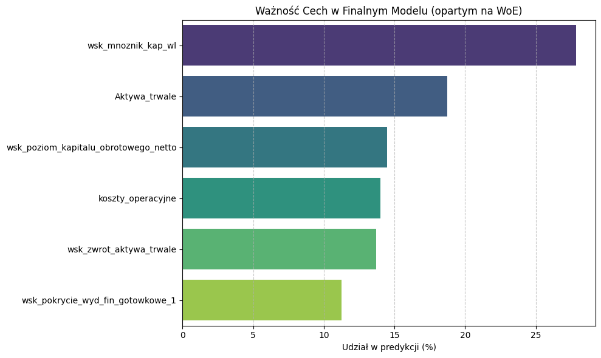

# Model Card: Credit Risk Scoring System 💳

**Autorzy:** Piotr Wysocki, Karol Kacprzak  
**Data:** 01.12.2025 
**Wersja:** 1.0  
**Typ modelu:** Klasyfikacja binarna (Probability of Default - PD)

---

## 1. Cel i Zakres Modelu (Intended Use)
Celem modelu jest ocena ryzyka kredytowego **podmiotów gospodarczych (przedsiębiorstw)** poprzez predykcję prawdopodobieństwa niewypłacalności (PD) w oparciu o **analizę wskaźnikową i dane ze sprawozdań finansowych**.

* **Zastosowanie:** Automatyzacja decyzji kredytowych w segmencie B2B (MŚP/Korporacje) oraz wsparcie analityków finansowych.
* **Target:** Zmienna binarna `default` (1 = niewypłacalność/bankructwo, 0 = podmiot "zdrowy").
* **Wymóg biznesowy:** Kalibracja średniego PD portfela do poziomu **4%** (Central Tendency).

---

## 2. Dane i Przetwarzanie (Data).

* **Rozmiar próby:** 3000 obserwacji.
* **Podział:** Train / Validation / Test w proporcji [np. 70/15/15] ze stratyfikacją wg zmiennej celu (default). Zbiór treningowy wykorzystany wyłącznie do treningu modeli. Zbiór walidacyjny do kalibracji, strojenia hiperparametrów oraz do ustalenia progu decyzyjnego. Zbiór testowy służył do sprawdzenia wyników wszystkich działań, a także interpretacji modeli.
**Zmienne wejściowe:** Wskaźniki analizy finansowej (płynność, rentowność, zadłużenie), dane ze sprawozdań (Bilans, RZiS) oraz charakterystyka podmiotu (branża PKD, forma prawna). Szczegóły w `Dane_Opis_zmiennych.pdf`.
W celu uniknięcia data leakage dane zostały podzielone przed całym preprocessingiem. Wszystkie preprocessingi obejmowały ujednolicony fit na train, następnie transform na train/val/test.
* **Preprocessing:**
Projekt obejmuje dwa niezależne preprocessingi dla obu różnych modeli. Użyte techniki to m.in.:
    * Braki danych: Imputacja medianą zmiennych numerycznych i modą zmiennych kategorycznych.
    * Outliery: Capping na poziomie [np. 1-99 percentyla] oraz IQR (w zależności od procentu braków).
    * Inżynieria cech: Przekształcenia logarytmiczne, Binning zmiennych ciągłych (WoE) z wymuszeniem monotoniczności (dla regresji).
    * Selekcja cech: Testy monotniczności, VIF, usuwanie zmiennych skorelowanych, usuwanie zmiennych dających niskie feature importance

---

## 3. Architektura Modeli
W projekcie porównano dwa podejścia:

1.  **Model Interpretowalny (White-box):**
    * *Algorytm:* Regresja logistyczna.
    * *Zaleta:* Pełna transparentność współczynników.
2.  **Model Zaawansowany (Black-box):**
    * *Algorytm:* LightGBM.
    * *Zaleta:* Wyższa siła dyskryminacyjna, wychwytywanie nieliniowości.
    * *Optymalizacja:* Bayesian optimization z wykorzystaniem Optuna.

---

## 4.1 Wyniki i Kalibracja (Performance - regresja)

### Metryki skuteczności (Zbiór Testowy) - regresja, model finalny po kalibracj i dostrojeniu progu decyzyjnego
| Metryka | Train | Validation | Test |
| :--- | :--- | :--- | :--- |
| **ROC AUC** | 0.7399 | 0.7688 | 0.7193 |
| **PR AUC** | 0.2348 | 0.2374 | 0.2324 |
| **KS** | 0.3843 | 0.4047 | 0.3431 |
| **Log-loss** | 0.3014 | 0.3052 | 0.3093 |

### Kalibracja (Calibration to 4%)
Model surowy został poddany kalibracji metodą **[Platt Scaling]** na zbiorze walidacyjnym i następnie oceniony na zbiorze testowym, aby wyrównać średnie przewidywane ryzyko do zakładanego poziomu w portfelu (4%). Następnie dostrojony został intercept.

* **Brier Score (przed kalibracją):** 0.08029
* **Brier Score (po kalibracji):** 0.08117
* **ECE po kalibracji na zbiorze testowym**: 0.0497
* **ACE po kalibracji na zbiorze testowym**: 0.0493

Na końcu zminimalizowano funkcję kosztu TP/FP tak, aby odpowiadała założonym stratom. Szczegóły w prezentacji.

### System Decyzyjny i Monotoniczność
Ze względu na niską liczebność próby testowej, przyjęto **3-stopniową skalę ratingową** (+ odrzucenie). Potwierdzono monotoniczność ryzyka (Realized Default Rate rośnie wraz z klasą).

| Klasa Ratingowa | Decyzja | Oczekiwane Ryzyko (RDR) |
| :--- | :--- | :--- |
| **A (Super Prime)** | Akceptacja (VIP / Fast track) | **0.00%** |
| **B (Prime)** | Akceptacja (Standard) | **~1.8%** |
| **C (High Risk)** | Weryfikacja (Manual/Dodatkowe zabezpieczenie) | **~8.6%** |
| **R (Reject)** | Odrzucenie (Cut-off) | **>20.0%** |

## 4.2  Wyniki i Kalibracja (Performance - black box)

### Metryki skuteczności (Zbiór Testowy) - black box, model finalny
| Metryka | Train | Validation | Test |
| :--- | :--- | :--- | :--- |
| **ROC AUC** | 0.8996 | 0.7802 | 0.7215 |
| **PR AUC** | 0.6296 | 0.3000 | 0.2462 |
| **KS** | 0.6168 | 0.4898 | 0.3809 |
| **Log-loss** | 0.2372 | 0.3519 | 0.3638 |
| **Brier** | 0.0674 | 0.0976 | 0.1013 |

### Kalibracja (Calibration to 4%)
Model surowy został poddany kalibracji metodą **[Platt Scaling]** na zbiorze walidacyjnym i następnie oceniony na zbiorze testowym, aby wyrównać średnie przewidywane ryzyko do zakładanego poziomu w portfelu (4%). Następnie dostrojony został intercept.

* **Brier Score (przed kalibracją):** ---
* **Brier Score (po kalibracji):** ---
* **ECE po kalibracji na zbiorze testowym**: 0.0508
* **ACE po kalibracji na zbiorze testowym**:  0.0719

| Klasa Ratingowa | Decyzja | Oczekiwane Ryzyko (RDR) |
| :--- | :--- | :--- |
| **A (Super Prime)** | Akceptacja (VIP / Fast track) | **0.00%** |
| **B (Prime)** | Akceptacja (Standard) | **1.52%** |
| **C (High Risk)** | Weryfikacja (Manual/Dodatkowe zabezpieczenie) | **3.42%** |
| **R (Reject)** | Odrzucenie (Cut-off) | **9.18%** |

---

## 5. Wyjaśnialność (Explainability & Interpretability)
### Globalna - regresja

Ponadto sprofilowany bin dla wskaźnika mnożnika kapitału własnego:
| Przedział_Biznesowy | WoE |
| :--- | :--- |
| **(-inf, 1.04]** | -0.146603 |
| **(1.04, 1.30]** | -0.210625 |
| **(1.30, 1.81]** | -0.744440 |
| **(1.81, 3.23]** | -0.085825 |
| **(3.23, inf]** | 0.725235 |
Widać zależność nieliniową - najbardziej ryzyko jest obniżono dla przedziału (1.04, 1.81) a dla skrajnych gorzej, w szczególności najbardziej ryzykowne są firmy z wysokim wskaźnikiem. 
Pozostałe zmienne: 
* Aktywa trwałe - im większe, tym mniejsze ryzyko kredytowe
* Wskaźnik poziomu kapitału obrotowego netto - większy zmniejsza ryzyko
* koszty operacyjne - preferowane firmy o skrajnych kosztach operacyjnych - może to oznaczać, że średnie spółki są najbardziej ryzykowne, podczas gdy giganci i działalności jednoosobowe są zazwyczaj mniej ryzykowne.
* wskaźnik zwrot na aktywach trwałych - najgorzej dla ujemnych wartości lub ekstremalnie wysokich
* Wskaźnik pokrycia wydatków finansowych gotówką - im wyżej, tym firma bezpieczniejsza.

### Globalna (Co napędza model?) - BlackBox
Analiza **SHAP Feature Importance** wskazała 5 kluczowych cech:
1.  **wsk_struktury_kapitalu:** niskie wartości sprzyjają wykrywaniu defaultów.
2.  **wsk_finansowania_majatku_kapitalem:** wysokie wartości zmniejszają prawdopodobieństwo defaultu
3.  **wsk_mnoznik_kap_wl:** wysokie wartości zwiększają prawdopodobieństwo defaultu

### Lokalna (Dlaczego ten klient?) - regresja logistyczna
Przeprowadzono analizę przypadków (Case Studies) przy użyciu interpretacji logitów oraz analizy what-if:
* **Przypadek graniczny:** 
| Zmienna | Wartość Oryginalna | Wartość WOE | Waga Modelu (Beta) | Wkład (Logit) |
| :--- | :--- | :--- | :--- | :--- |
| **wsk_mnoznik_kap_wl** | 5.99784 | 0.725235 | 1.141125 | 0.827584 |
| **Aktywa_trwale** | 79,188,171.22 | -0.744440 | 0.768090 | -0.571797 |
| **koszty_operacyjne** | 5,735.50 | 0.535244 | 0.574498 | 0.307497 |
| **wsk_pokrycie_wyd_fin_gotowkowe_1** | 0.00 | -0.387766 | 0.460986 | -0.178755 |
| **wsk_poziom_kapitalu_obrotowego_netto** | 168,278.04 | 0.131028 | 0.592846 | 0.077680 |
| **wsk_zwrot_aktywa_trwale** | 31,060.57 | 0.080247 | 0.562389 | 0.045130 |
Przewidziane prawdopodobieństwo defaultu dla klienta to 6.9134%. Klientów klasyfikujemy jako takich, którzy spłacą poniżej 6.1%. Na podstawie analizy what-if widać, że po zmianie wskaźniku kapitału własnego poniżej 3.2 klient wpada do "lepszego koszyka". Zmienia to jego prawdopodobieństwo na 3.8219%.

* **Przypadek graniczny2:** Klient, któremu udzielamy kredytu, ale wymaga monitoringu
| Zmienna | Wartość Oryginalna | Wartość WOE | Waga Modelu (Beta) | Wkład (Logit) |
| :--- | :--- | :--- | :--- | :--- |
| **koszty_operacyjne** | 7,526.00 | 0.535244 | 0.574498 | 0.307497 |
| **Aktywa_trwale** | 500.00 | 0.337643 | 0.768090 | 0.259340 |
| **wsk_mnoznik_kap_wl** | 1.060789 | -0.210625 | 1.141125 | -0.240350 |
| **wsk_poziom_kapitalu_obrotowego_netto** | 36,233.06 | 0.379490 | 0.592846 | 0.224979 |
| **wsk_pokrycie_wyd_fin_gotowkowe_1** | 46.49 | -0.278300 | 0.460986 | -0.128293 |
| **wsk_zwrot_aktywa_trwale** | 313.2874 | -0.210625 | 0.562389 | -0.118453 |
Przewidziane prawdopodobieństwo: 5.7179%, jednak po zmianie na wskaźnika poziomu kapitału obrotowego netto na 9500 (ok. poniżej 10000) spada w gorszy próg, co spowoduje klasyfikację jako default.

* **Przypadek neutralny z klientem, który wygląda bezpiecznie**:
| Zmienna | Wartość Oryginalna | Wartość WOE | Waga Modelu (Beta) | Wkład (Logit) |
| :--- | :--- | :--- | :--- | :--- |
| **koszty_operacyjne** | 11,754,746.28 | -0.693147 | 0.574498 | -0.398212 |
| **wsk_zwrot_aktywa_trwale** | -1.822101 | 0.624612 | 0.562389 | 0.351275 |
| **wsk_poziom_kapitalu_obrotowego_netto** | 751,906.16 | -0.552069 | 0.592846 | -0.327291 |
| **wsk_pokrycie_wyd_fin_gotowkowe_1** | -155.080904 | 0.708918 | 0.460986 | 0.326802 |
| **wsk_mnoznik_kap_wl** | 2.6286 | -0.085825 | 1.141125 | -0.097937 |
| **Aktywa_trwale** | 211,624.31 | -0.059951 | 0.768090 | -0.046048 |
Prawdopodobieństwo: 3.5612%.

### Lokalna - BlackBox

Przykład wpływu poszczególnych zmiennych na wykrywanie defaultów na podstawie shap force plot oraz lime (dla tych samych obserwacji)

### Audyt Podgrup pod względem kodów pKD.

dla danych ograniczonych do jednej wartości zmiennej pkdKod wykresy wpływu poszczególnych wartości cech na predykcje modelu są zbliżone do wykresów uzyskanych dla całych danych - model ocenia ogolne warunki funkcjonowania podmiotów (szczegóły prezentacja)

---

## 6. Ograniczenia i Ryzyka (Limitations & Risks)
1.  **Reprezentatywność próby:** Model bazuje na danych historycznych. Nagła zmiana koniunktury gospodarczej może wymagać rekalibracji (ryzyko niestabilności makroekonomicznej). Należy śledzić PSI/CSI.
2.  **Black-box:** Model Black-Box wydaje się nieco przeuczony, może mieć momentami problemy dla nowych danych.
3.  **Złożone zależności** Na regresji logistycznej ryzyko, że koszyki WoE nie odzwierciedlą prawdziwych danych.

---

## 7. Plan Monitoringu (Monitoring Plan)
Aby utrzymać jakość modelu na produkcji, zaleca się comiesięczny monitoring:

1.  **PSI (Population Stability Index):** Alarm, jeśli PSI > 0.1 (oznacza zmianę profilu klientów).
2.  **Analiza Vintage:** Porównanie `Expected PD` vs `Realized DR` po 3, 6, 9, 12 miesiącach.
3.  **Koncentracja klas:** Monitorowanie odsetka klientów wpadających do klasy `R` (nagły wzrost oznaczaalby zbyt restrykcyjną politykę lub pogorszenie jakości wniosków).

